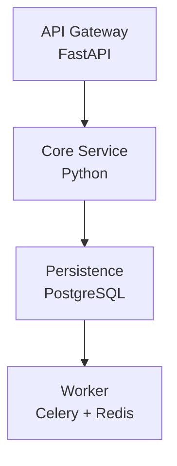
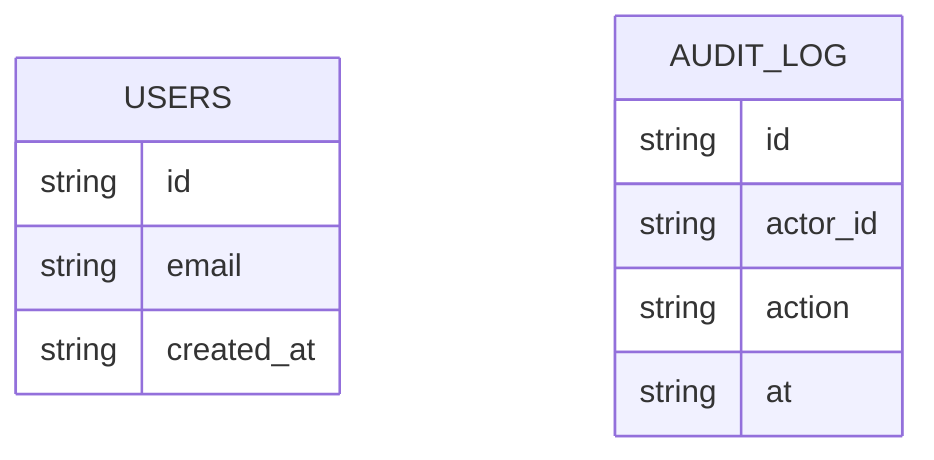

# Delivery pack — run `sample_brs-43096e`

Source: `data/samples/sample_brs.md`

## Business summary

**Goals**
- Reduce appointment no-show rates by at least 20% within two quarters of launch.
- Cut administrative time spent on appointment handling by half.
- Give patients self-service access to appointments, prescriptions and test results.
- Provide clinic managers with utilisation reporting across all eleven centres.
- Patient contact details in the existing spreadsheet are accurate enough to migrate.
- LabConnect will continue to expose its current HL7 interface for at least two years.
- Each centre has reliable broadband during operating hours.
- What is the required retention period for audit logs? TBD with governance.

**Stakeholders**
- Patients (primary end users, approximately 48,000 active records)
- Front-desk administrators at each centre
- Clinicians (doctors, nurse practitioners)
- Clinic operations managers
- The information governance officer

**In scope**
- Patients must be able to register an account and verify their identity by email and SMS.
- The system shall allow patients to book, reschedule and cancel appointments online.
- The system must send appointment reminders 48 hours and 2 hours before the appointment.
- Patients shall be able to view their prescription history and download test results as PDF.
- Clinicians must be able to view a daily schedule and mark appointments as completed or missed.
- The staff console shall provide a utilisation report per centre per week.
- The system must integrate with the existing LabConnect results feed over HL7.
- All access to patient records must be logged with actor, action and timestamp.
- The portal must support English and Marathi.
- Patient data must be encrypted at rest and in transit.
- The system shall maintain 99.5% uptime during clinic operating hours.
- Page responses must complete within 2 seconds for 95% of requests under normal load.
- The system must support 500 concurrent users at peak.
- Front-desk staff shall be trained on the new console before each centre goes live.
- A patient-facing user guide must be published in both supported languages.
- The information governance officer must sign off the data protection impact assessment before launch.
- A rollback and communication plan must be agreed with clinic managers prior to each rollout.
- Vendor contracts for SMS delivery must be finalised by the procurement team.

**Out of scope**
- Video consultation and telemedicine features.
- Billing, insurance claims and payment processing.
- Native mobile applications (the portal must be responsive on mobile browsers instead).
- Integration with the legacy PACS imaging system.

**Constraints**
- The solution must comply with applicable health data protection regulations.
- The project budget is capped and the first release must ship within six months.
- The clinic's existing identity provider must be used for staff login via SSO.
- Hosting must remain within the country for data residency reasons.

## Identified gaps

- **What is the required retention period for audit logs? TBD with governance.** — Not researched (RESEARCH_ENABLED=false). _(confidence 0.0)_
- **Should cancelled appointments be automatically offered to a waiting list?** — Not researched (RESEARCH_ENABLED=false). _(confidence 0.0)_
- **Which appointment types can be booked without triage? To be decided by clinical leads.** — Not researched (RESEARCH_ENABLED=false). _(confidence 0.0)_
- **Under-specified: What is the required retention period for audit logs? TBD with governance.** — Not researched (RESEARCH_ENABLED=false). _(confidence 0.0)_

# Sample Brs

## 1. Introduction
This SRS is generated from the supplied BRS and follows an IEEE-830-style structure.

## 2. Overall description
Reduce appointment no-show rates by at least 20% within two quarters of launch.; Cut administrative time spent on appointment handling by half.; Give patients self-service access to appointments, prescriptions and test results.

## 3. Requirements

| ID | Type | Priority | Kind | Discipline | Requirement |
|---|---|---|---|---|---|
| REQ-001 | functional | should | technical | backend | Reduce appointment no-show rates by at least 20% within two quarters of launch |
| REQ-002 | functional | should | technical | backend | Cut administrative time spent on appointment handling by half |
| REQ-003 | functional | should | technical | qa | Give patients self-service access to appointments, prescriptions and test results |
| REQ-004 | functional | should | technical | data | Provide clinic managers with utilisation reporting across all eleven centres |
| REQ-005 | functional | should | technical | backend | Patient contact details in the existing spreadsheet are accurate enough to migrate |
| REQ-006 | functional | should | technical | backend | LabConnect will continue to expose its current HL7 interface for at least two years |
| REQ-007 | functional | should | technical | backend | Each centre has reliable broadband during operating hours |
| REQ-008 | functional | should | technical | frontend | What is the required retention period for audit logs? TBD with governance |
| REQ-009 | functional | should | technical | backend | Patients (primary end users, approximately 48,000 active records) |
| REQ-010 | functional | should | technical | backend | Front-desk administrators at each centre |
| REQ-011 | functional | should | technical | backend | Clinicians (doctors, nurse practitioners) |
| REQ-012 | functional | should | technical | backend | Clinic operations managers |
| REQ-013 | functional | should | non_technical | business | The information governance officer |
| REQ-014 | functional | must | technical | qa | Patients must be able to register an account and verify their identity by email and SMS |
| REQ-015 | functional | should | technical | backend | The system shall allow patients to book, reschedule and cancel appointments online |
| REQ-016 | functional | must | technical | backend | The system must send appointment reminders 48 hours and 2 hours before the appointment |
| REQ-017 | functional | should | technical | qa | Patients shall be able to view their prescription history and download test results as PDF |
| REQ-018 | functional | must | technical | backend | Clinicians must be able to view a daily schedule and mark appointments as completed or missed |
| REQ-019 | functional | should | technical | data | The staff console shall provide a utilisation report per centre per week |
| REQ-020 | functional | must | technical | backend | The system must integrate with the existing LabConnect results feed over HL7 |
| REQ-021 | functional | must | technical | backend | All access to patient records must be logged with actor, action and timestamp |
| REQ-022 | functional | must | technical | backend | The portal must support English and Marathi |
| REQ-023 | non_functional | must | technical | backend | Patient data must be encrypted at rest and in transit |
| REQ-024 | non_functional | should | technical | devops | The system shall maintain 99.5% uptime during clinic operating hours |
| REQ-025 | functional | must | technical | frontend | Page responses must complete within 2 seconds for 95% of requests under normal load |
| REQ-026 | non_functional | must | technical | backend | The system must support 500 concurrent users at peak |
| REQ-027 | functional | should | non_technical | business | Front-desk staff shall be trained on the new console before each centre goes live |
| REQ-028 | functional | must | non_technical | business | A patient-facing user guide must be published in both supported languages |
| REQ-029 | functional | must | non_technical | business | The information governance officer must sign off the data protection impact assessment before launch |
| REQ-030 | functional | must | non_technical | business | A rollback and communication plan must be agreed with clinic managers prior to each rollout |
| REQ-031 | functional | must | non_technical | business | Vendor contracts for SMS delivery must be finalised by the procurement team |
| REQ-032 | functional | should | technical | backend | Video consultation and telemedicine features |
| REQ-033 | functional | should | technical | backend | Billing, insurance claims and payment processing |
| REQ-034 | functional | must | technical | frontend | Native mobile applications (the portal must be responsive on mobile browsers instead) |
| REQ-035 | functional | should | technical | backend | Integration with the legacy PACS imaging system |
| REQ-036 | constraint | must | technical | backend | The solution must comply with applicable health data protection regulations |
| REQ-037 | constraint | must | non_technical | business | The project budget is capped and the first release must ship within six months |
| REQ-038 | functional | must | technical | backend | The clinic's existing identity provider must be used for staff login via SSO |
| REQ-039 | functional | must | technical | backend | Hosting must remain within the country for data residency reasons |
| REQ-040 | functional | should | technical | frontend | Q: What is the required retention period for audit logs? TBD with governance |
| REQ-041 | functional | should | technical | backend | Q: Should cancelled appointments be automatically offered to a waiting list? |
| REQ-042 | functional | should | technical | backend | Q: Which appointment types can be booked without triage? To be decided by clinical leads |
| REQ-043 | functional | should | technical | frontend | Q: Under-specified: What is the required retention period for audit logs? TBD with governance |

### 3.1 Acceptance criteria

**REQ-001** — Reduce appointment no-show rates by at least 20% within two quarters of launch
- Given the system is available, when the scenario in Reduce appointment no-show rates by at l… is exercised, then the documented behaviour is observed.

**REQ-002** — Cut administrative time spent on appointment handling by half
- Given the system is available, when the scenario in Cut administrative time spent on appoint… is exercised, then the documented behaviour is observed.

**REQ-003** — Give patients self-service access to appointments, prescriptions and test results
- Given the system is available, when the scenario in Give patients self-service access to app… is exercised, then the documented behaviour is observed.

**REQ-004** — Provide clinic managers with utilisation reporting across all eleven centres
- Given the system is available, when the scenario in Provide clinic managers with utilisation… is exercised, then the documented behaviour is observed.

**REQ-005** — Patient contact details in the existing spreadsheet are accurate enough to migrate
- Given the system is available, when the scenario in Patient contact details in the existing… is exercised, then the documented behaviour is observed.

**REQ-006** — LabConnect will continue to expose its current HL7 interface for at least two years
- Given the system is available, when the scenario in LabConnect will continue to expose its c… is exercised, then the documented behaviour is observed.

**REQ-007** — Each centre has reliable broadband during operating hours
- Given the system is available, when the scenario in Each centre has reliable broadband durin… is exercised, then the documented behaviour is observed.

**REQ-008** — What is the required retention period for audit logs? TBD with governance
- Given the system is available, when the scenario in What is the required retention period fo… is exercised, then the documented behaviour is observed.

**REQ-009** — Patients (primary end users, approximately 48,000 active records)
- Given the system is available, when the scenario in Patients (primary end users, approximate… is exercised, then the documented behaviour is observed.

**REQ-010** — Front-desk administrators at each centre
- Given the system is available, when the scenario in Front-desk administrators at each centre… is exercised, then the documented behaviour is observed.

**REQ-011** — Clinicians (doctors, nurse practitioners)
- Given the system is available, when the scenario in Clinicians (doctors, nurse practitioners… is exercised, then the documented behaviour is observed.

**REQ-012** — Clinic operations managers
- Given the system is available, when the scenario in Clinic operations managers… is exercised, then the documented behaviour is observed.

**REQ-013** — The information governance officer
- Given the system is available, when the scenario in The information governance officer… is exercised, then the documented behaviour is observed.

**REQ-014** — Patients must be able to register an account and verify their identity by email and SMS
- Given the system is available, when the scenario in Patients must be able to register an acc… is exercised, then the documented behaviour is observed.

**REQ-015** — The system shall allow patients to book, reschedule and cancel appointments online
- Given the system is available, when the scenario in The system shall allow patients to book,… is exercised, then the documented behaviour is observed.

**REQ-016** — The system must send appointment reminders 48 hours and 2 hours before the appointment
- Given the system is available, when the scenario in The system must send appointment reminde… is exercised, then the documented behaviour is observed.

**REQ-017** — Patients shall be able to view their prescription history and download test results as PDF
- Given the system is available, when the scenario in Patients shall be able to view their pre… is exercised, then the documented behaviour is observed.

**REQ-018** — Clinicians must be able to view a daily schedule and mark appointments as completed or missed
- Given the system is available, when the scenario in Clinicians must be able to view a daily… is exercised, then the documented behaviour is observed.

**REQ-019** — The staff console shall provide a utilisation report per centre per week
- Given the system is available, when the scenario in The staff console shall provide a utilis… is exercised, then the documented behaviour is observed.

**REQ-020** — The system must integrate with the existing LabConnect results feed over HL7
- Given the system is available, when the scenario in The system must integrate with the exist… is exercised, then the documented behaviour is observed.

**REQ-021** — All access to patient records must be logged with actor, action and timestamp
- Given the system is available, when the scenario in All access to patient records must be lo… is exercised, then the documented behaviour is observed.

**REQ-022** — The portal must support English and Marathi
- Given the system is available, when the scenario in The portal must support English and Mara… is exercised, then the documented behaviour is observed.

**REQ-023** — Patient data must be encrypted at rest and in transit
- Given the system is available, when the scenario in Patient data must be encrypted at rest a… is exercised, then the documented behaviour is observed.

**REQ-024** — The system shall maintain 99.5% uptime during clinic operating hours
- Given the system is available, when the scenario in The system shall maintain 99.5% uptime d… is exercised, then the documented behaviour is observed.

**REQ-025** — Page responses must complete within 2 seconds for 95% of requests under normal load
- Given the system is available, when the scenario in Page responses must complete within 2 se… is exercised, then the documented behaviour is observed.

**REQ-026** — The system must support 500 concurrent users at peak
- Given the system is available, when the scenario in The system must support 500 concurrent u… is exercised, then the documented behaviour is observed.

**REQ-027** — Front-desk staff shall be trained on the new console before each centre goes live
- Given the system is available, when the scenario in Front-desk staff shall be trained on the… is exercised, then the documented behaviour is observed.

**REQ-028** — A patient-facing user guide must be published in both supported languages
- Given the system is available, when the scenario in A patient-facing user guide must be publ… is exercised, then the documented behaviour is observed.

**REQ-029** — The information governance officer must sign off the data protection impact assessment before launch
- Given the system is available, when the scenario in The information governance officer must… is exercised, then the documented behaviour is observed.

**REQ-030** — A rollback and communication plan must be agreed with clinic managers prior to each rollout
- Given the system is available, when the scenario in A rollback and communication plan must b… is exercised, then the documented behaviour is observed.

**REQ-031** — Vendor contracts for SMS delivery must be finalised by the procurement team
- Given the system is available, when the scenario in Vendor contracts for SMS delivery must b… is exercised, then the documented behaviour is observed.

**REQ-032** — Video consultation and telemedicine features
- Given the system is available, when the scenario in Video consultation and telemedicine feat… is exercised, then the documented behaviour is observed.

**REQ-033** — Billing, insurance claims and payment processing
- Given the system is available, when the scenario in Billing, insurance claims and payment pr… is exercised, then the documented behaviour is observed.

**REQ-034** — Native mobile applications (the portal must be responsive on mobile browsers instead)
- Given the system is available, when the scenario in Native mobile applications (the portal m… is exercised, then the documented behaviour is observed.

**REQ-035** — Integration with the legacy PACS imaging system
- Given the system is available, when the scenario in Integration with the legacy PACS imaging… is exercised, then the documented behaviour is observed.

**REQ-036** — The solution must comply with applicable health data protection regulations
- Given the system is available, when the scenario in The solution must comply with applicable… is exercised, then the documented behaviour is observed.

**REQ-037** — The project budget is capped and the first release must ship within six months
- Given the system is available, when the scenario in The project budget is capped and the fir… is exercised, then the documented behaviour is observed.

**REQ-038** — The clinic's existing identity provider must be used for staff login via SSO
- Given the system is available, when the scenario in The clinic's existing identity provider… is exercised, then the documented behaviour is observed.

**REQ-039** — Hosting must remain within the country for data residency reasons
- Given the system is available, when the scenario in Hosting must remain within the country f… is exercised, then the documented behaviour is observed.

**REQ-040** — Q: What is the required retention period for audit logs? TBD with governance
- Given the system is available, when the scenario in Q: What is the required retention period… is exercised, then the documented behaviour is observed.

**REQ-041** — Q: Should cancelled appointments be automatically offered to a waiting list?
- Given the system is available, when the scenario in Q: Should cancelled appointments be auto… is exercised, then the documented behaviour is observed.

**REQ-042** — Q: Which appointment types can be booked without triage? To be decided by clinical leads
- Given the system is available, when the scenario in Q: Which appointment types can be booked… is exercised, then the documented behaviour is observed.

**REQ-043** — Q: Under-specified: What is the required retention period for audit logs? TBD with governance
- Given the system is available, when the scenario in Q: Under-specified: What is the required… is exercised, then the documented behaviour is observed.

## 4. Use cases

### UC-001 — Reduce appointment no-show rates by at least 20% within two 
**Actor:** Patients (primary end users, approximately 48,000 active records)

**Preconditions**
- User is authenticated.

**Main flow**
1. User initiates the action.
2. System validates input.
3. System persists and confirms.

**Alternate flows**
- Validation fails -> system returns a descriptive error.

### UC-002 — Cut administrative time spent on appointment handling by hal
**Actor:** Front-desk administrators at each centre

**Preconditions**
- User is authenticated.

**Main flow**
1. User initiates the action.
2. System validates input.
3. System persists and confirms.

**Alternate flows**
- Validation fails -> system returns a descriptive error.

### UC-003 — Give patients self-service access to appointments, prescript
**Actor:** Clinicians (doctors, nurse practitioners)

**Preconditions**
- User is authenticated.

**Main flow**
1. User initiates the action.
2. System validates input.
3. System persists and confirms.

**Alternate flows**
- Validation fails -> system returns a descriptive error.

### UC-004 — Provide clinic managers with utilisation reporting across al
**Actor:** Clinic operations managers

**Preconditions**
- User is authenticated.

**Main flow**
1. User initiates the action.
2. System validates input.
3. System persists and confirms.

**Alternate flows**
- Validation fails -> system returns a descriptive error.

### UC-005 — Patient contact details in the existing spreadsheet are accu
**Actor:** The information governance officer

**Preconditions**
- User is authenticated.

**Main flow**
1. User initiates the action.
2. System validates input.
3. System persists and confirms.

**Alternate flows**
- Validation fails -> system returns a descriptive error.

## High-level design

Layered service: gateway -> core service -> persistence, with async workers.

### Components

| Component | Responsibility | Tech | Depends on |
|---|---|---|---|
| API Gateway | Routing, auth, rate limiting | FastAPI | - |
| Core Service | Business rules and orchestration | Python | API Gateway |
| Persistence | Relational storage | PostgreSQL | Core Service |
| Worker | Async and scheduled jobs | Celery + Redis | Persistence |

### Data flow

Client -> API Gateway -> Core Service -> Persistence; long-running work is queued to Worker.

### API contracts

| Method | Path | Summary |
|---|---|---|
| POST | `/api/v1/reduce-appointment-no-sh` | Reduce appointment no-show rates by at least 20% within two quarters of launch |
| GET | `/api/v1/cut-administrative-time` | Cut administrative time spent on appointment handling by half |
| POST | `/api/v1/give-patients-self-servi` | Give patients self-service access to appointments, prescriptions and test result |
| GET | `/api/v1/provide-clinic-managers` | Provide clinic managers with utilisation reporting across all eleven centres |
| POST | `/api/v1/patient-contact-details` | Patient contact details in the existing spreadsheet are accurate enough to migra |
| GET | `/api/v1/labconnect-will-continue` | LabConnect will continue to expose its current HL7 interface for at least two ye |

### Data model

**users**
- `id` — uuid pk
- `email` — text unique
- `created_at` — timestamptz

**audit_log**
- `id` — bigserial pk
- `actor_id` — uuid fk
- `action` — text
- `at` — timestamptz

## Sprint plan

### Sprint 1 — 24/25 points

| Ticket | Title | Points | Labels | Blocked by |
|---|---|---|---|---|
| TCK-001 | Design & spec: Reduce appointment no-show rates by at least 20% within | 3 | backend, REQ-001 | - |
| TCK-004 | Design & spec: Cut administrative time spent on appointment handling b | 3 | backend, REQ-002 | - |
| TCK-007 | Design & spec: Give patients self-service access to appointments, pres | 3 | qa, REQ-003 | - |
| TCK-010 | Design & spec: Provide clinic managers with utilisation reporting acro | 3 | data, REQ-004 | - |
| TCK-013 | Design & spec: Patient contact details in the existing spreadsheet are | 3 | backend, REQ-005 | - |
| TCK-016 | Design & spec: LabConnect will continue to expose its current HL7 inte | 3 | backend, REQ-006 | - |
| TCK-022 | Design & spec: What is the required retention period for audit logs? T | 3 | frontend, REQ-008 | - |
| TCK-025 | Design & spec: Patients (primary end users, approximately 48,000 activ | 3 | backend, REQ-009 | - |

### Sprint 2 — 24/25 points

| Ticket | Title | Points | Labels | Blocked by |
|---|---|---|---|---|
| TCK-037 | Design & spec: Patients must be able to register an account and verify | 3 | qa, REQ-014 | - |
| TCK-040 | Design & spec: The system shall allow patients to book, reschedule and | 3 | backend, REQ-015 | - |
| TCK-043 | Design & spec: The system must send appointment reminders 48 hours and | 3 | backend, REQ-016 | - |
| TCK-046 | Design & spec: Patients shall be able to view their prescription histo | 3 | qa, REQ-017 | - |
| TCK-049 | Design & spec: Clinicians must be able to view a daily schedule and ma | 3 | backend, REQ-018 | - |
| TCK-052 | Design & spec: The staff console shall provide a utilisation report pe | 3 | data, REQ-019 | - |
| TCK-055 | Design & spec: The system must integrate with the existing LabConnect | 3 | backend, REQ-020 | - |
| TCK-058 | Design & spec: All access to patient records must be logged with actor | 3 | backend, REQ-021 | - |

### Sprint 3 — 24/25 points

| Ticket | Title | Points | Labels | Blocked by |
|---|---|---|---|---|
| TCK-067 | Design & spec: The system shall maintain 99.5% uptime during clinic op | 3 | devops, REQ-024 | - |
| TCK-070 | Design & spec: Page responses must complete within 2 seconds for 95% o | 3 | frontend, REQ-025 | - |
| TCK-082 | Design & spec: Native mobile applications (the portal must be responsi | 3 | frontend, REQ-034 | - |
| TCK-088 | Design & spec: The solution must comply with applicable health data pr | 3 | backend, REQ-036 | - |
| TCK-091 | Design & spec: The clinic's existing identity provider must be used fo | 3 | backend, REQ-038 | - |
| TCK-094 | Design & spec: Hosting must remain within the country for data residen | 3 | backend, REQ-039 | - |
| TCK-097 | Design & spec: Q: What is the required retention period for audit logs | 3 | frontend, REQ-040 | - |
| TCK-100 | Design & spec: Q: Should cancelled appointments be automatically offer | 3 | backend, REQ-041 | - |

### Sprint 4 — 25/25 points

| Ticket | Title | Points | Labels | Blocked by |
|---|---|---|---|---|
| TCK-103 | Design & spec: Q: Which appointment types can be booked without triage | 3 | backend, REQ-042 | - |
| TCK-106 | Design & spec: Q: Under-specified: What is the required retention peri | 3 | frontend, REQ-043 | - |
| TCK-002 | Implement: Reduce appointment no-show rates by at least 20% within | 5 | backend, REQ-001 | TCK-001 |
| TCK-005 | Implement: Cut administrative time spent on appointment handling b | 5 | backend, REQ-002 | TCK-004 |
| TCK-008 | Implement: Give patients self-service access to appointments, pres | 5 | qa, REQ-003 | TCK-007 |
| TCK-019 | Design & spec: Each centre has reliable broadband during operating hou | 2 | backend, REQ-007 | - |
| TCK-028 | Design & spec: Front-desk administrators at each centre | 2 | backend, REQ-010 | - |

### Sprint 5 — 25/25 points

| Ticket | Title | Points | Labels | Blocked by |
|---|---|---|---|---|
| TCK-011 | Implement: Provide clinic managers with utilisation reporting acro | 5 | data, REQ-004 | TCK-010 |
| TCK-014 | Implement: Patient contact details in the existing spreadsheet are | 5 | backend, REQ-005 | TCK-013 |
| TCK-017 | Implement: LabConnect will continue to expose its current HL7 inte | 5 | backend, REQ-006 | TCK-016 |
| TCK-023 | Implement: What is the required retention period for audit logs? T | 5 | frontend, REQ-008 | TCK-022 |
| TCK-026 | Implement: Patients (primary end users, approximately 48,000 activ | 5 | backend, REQ-009 | TCK-025 |

### Sprint 6 — 25/25 points

| Ticket | Title | Points | Labels | Blocked by |
|---|---|---|---|---|
| TCK-038 | Implement: Patients must be able to register an account and verify | 5 | qa, REQ-014 | TCK-037 |
| TCK-041 | Implement: The system shall allow patients to book, reschedule and | 5 | backend, REQ-015 | TCK-040 |
| TCK-044 | Implement: The system must send appointment reminders 48 hours and | 5 | backend, REQ-016 | TCK-043 |
| TCK-047 | Implement: Patients shall be able to view their prescription histo | 5 | qa, REQ-017 | TCK-046 |
| TCK-050 | Implement: Clinicians must be able to view a daily schedule and ma | 5 | backend, REQ-018 | TCK-049 |

### Sprint 7 — 25/25 points

| Ticket | Title | Points | Labels | Blocked by |
|---|---|---|---|---|
| TCK-053 | Implement: The staff console shall provide a utilisation report pe | 5 | data, REQ-019 | TCK-052 |
| TCK-056 | Implement: The system must integrate with the existing LabConnect | 5 | backend, REQ-020 | TCK-055 |
| TCK-059 | Implement: All access to patient records must be logged with actor | 5 | backend, REQ-021 | TCK-058 |
| TCK-068 | Implement: The system shall maintain 99.5% uptime during clinic op | 5 | devops, REQ-024 | TCK-067 |
| TCK-071 | Implement: Page responses must complete within 2 seconds for 95% o | 5 | frontend, REQ-025 | TCK-070 |

### Sprint 8 — 25/25 points

| Ticket | Title | Points | Labels | Blocked by |
|---|---|---|---|---|
| TCK-083 | Implement: Native mobile applications (the portal must be responsi | 5 | frontend, REQ-034 | TCK-082 |
| TCK-089 | Implement: The solution must comply with applicable health data pr | 5 | backend, REQ-036 | TCK-088 |
| TCK-092 | Implement: The clinic's existing identity provider must be used fo | 5 | backend, REQ-038 | TCK-091 |
| TCK-095 | Implement: Hosting must remain within the country for data residen | 5 | backend, REQ-039 | TCK-094 |
| TCK-098 | Implement: Q: What is the required retention period for audit logs | 5 | frontend, REQ-040 | TCK-097 |

### Sprint 9 — 25/25 points

| Ticket | Title | Points | Labels | Blocked by |
|---|---|---|---|---|
| TCK-101 | Implement: Q: Should cancelled appointments be automatically offer | 5 | backend, REQ-041 | TCK-100 |
| TCK-104 | Implement: Q: Which appointment types can be booked without triage | 5 | backend, REQ-042 | TCK-103 |
| TCK-107 | Implement: Q: Under-specified: What is the required retention peri | 5 | frontend, REQ-043 | TCK-106 |
| TCK-031 | Design & spec: Clinicians (doctors, nurse practitioners) | 2 | backend, REQ-011 | - |
| TCK-034 | Design & spec: Clinic operations managers | 2 | backend, REQ-012 | - |
| TCK-061 | Design & spec: The portal must support English and Marathi | 2 | backend, REQ-022 | - |
| TCK-064 | Design & spec: Patient data must be encrypted at rest and in transit | 2 | backend, REQ-023 | - |
| TCK-073 | Design & spec: The system must support 500 concurrent users at peak | 2 | backend, REQ-026 | - |

### Sprint 10 — 24/25 points

| Ticket | Title | Points | Labels | Blocked by |
|---|---|---|---|---|
| TCK-076 | Design & spec: Video consultation and telemedicine features | 2 | backend, REQ-032 | - |
| TCK-079 | Design & spec: Billing, insurance claims and payment processing | 2 | backend, REQ-033 | - |
| TCK-085 | Design & spec: Integration with the legacy PACS imaging system | 2 | backend, REQ-035 | - |
| TCK-020 | Implement: Each centre has reliable broadband during operating hou | 3 | backend, REQ-007 | TCK-019 |
| TCK-029 | Implement: Front-desk administrators at each centre | 3 | backend, REQ-010 | TCK-028 |
| TCK-032 | Implement: Clinicians (doctors, nurse practitioners) | 3 | backend, REQ-011 | TCK-031 |
| TCK-035 | Implement: Clinic operations managers | 3 | backend, REQ-012 | TCK-034 |
| TCK-062 | Implement: The portal must support English and Marathi | 3 | backend, REQ-022 | TCK-061 |
| TCK-065 | Implement: Patient data must be encrypted at rest and in transit | 3 | backend, REQ-023 | TCK-064 |

### Sprint 11 — 25/25 points

| Ticket | Title | Points | Labels | Blocked by |
|---|---|---|---|---|
| TCK-074 | Implement: The system must support 500 concurrent users at peak | 3 | backend, REQ-026 | TCK-073 |
| TCK-077 | Implement: Video consultation and telemedicine features | 3 | backend, REQ-032 | TCK-076 |
| TCK-080 | Implement: Billing, insurance claims and payment processing | 3 | backend, REQ-033 | TCK-079 |
| TCK-086 | Implement: Integration with the legacy PACS imaging system | 3 | backend, REQ-035 | TCK-085 |
| TCK-003 | Test: Reduce appointment no-show rates by at least 20% within | 2 | qa, REQ-001 | TCK-002 |
| TCK-006 | Test: Cut administrative time spent on appointment handling b | 2 | qa, REQ-002 | TCK-005 |
| TCK-009 | Test: Give patients self-service access to appointments, pres | 2 | qa, REQ-003 | TCK-008 |
| TCK-012 | Test: Provide clinic managers with utilisation reporting acro | 2 | qa, REQ-004 | TCK-011 |
| TCK-015 | Test: Patient contact details in the existing spreadsheet are | 2 | qa, REQ-005 | TCK-014 |
| TCK-018 | Test: LabConnect will continue to expose its current HL7 inte | 2 | qa, REQ-006 | TCK-017 |
| TCK-021 | Test: Each centre has reliable broadband during operating hou | 1 | qa, REQ-007 | TCK-020 |

### Sprint 12 — 25/25 points

| Ticket | Title | Points | Labels | Blocked by |
|---|---|---|---|---|
| TCK-024 | Test: What is the required retention period for audit logs? T | 2 | qa, REQ-008 | TCK-023 |
| TCK-027 | Test: Patients (primary end users, approximately 48,000 activ | 2 | qa, REQ-009 | TCK-026 |
| TCK-039 | Test: Patients must be able to register an account and verify | 2 | qa, REQ-014 | TCK-038 |
| TCK-042 | Test: The system shall allow patients to book, reschedule and | 2 | qa, REQ-015 | TCK-041 |
| TCK-045 | Test: The system must send appointment reminders 48 hours and | 2 | qa, REQ-016 | TCK-044 |
| TCK-048 | Test: Patients shall be able to view their prescription histo | 2 | qa, REQ-017 | TCK-047 |
| TCK-051 | Test: Clinicians must be able to view a daily schedule and ma | 2 | qa, REQ-018 | TCK-050 |
| TCK-054 | Test: The staff console shall provide a utilisation report pe | 2 | qa, REQ-019 | TCK-053 |
| TCK-057 | Test: The system must integrate with the existing LabConnect | 2 | qa, REQ-020 | TCK-056 |
| TCK-060 | Test: All access to patient records must be logged with actor | 2 | qa, REQ-021 | TCK-059 |
| TCK-069 | Test: The system shall maintain 99.5% uptime during clinic op | 2 | qa, REQ-024 | TCK-068 |
| TCK-072 | Test: Page responses must complete within 2 seconds for 95% o | 2 | qa, REQ-025 | TCK-071 |
| TCK-030 | Test: Front-desk administrators at each centre | 1 | qa, REQ-010 | TCK-029 |

### Sprint 13 — 24/25 points

| Ticket | Title | Points | Labels | Blocked by |
|---|---|---|---|---|
| TCK-084 | Test: Native mobile applications (the portal must be responsi | 2 | qa, REQ-034 | TCK-083 |
| TCK-090 | Test: The solution must comply with applicable health data pr | 2 | qa, REQ-036 | TCK-089 |
| TCK-093 | Test: The clinic's existing identity provider must be used fo | 2 | qa, REQ-038 | TCK-092 |
| TCK-096 | Test: Hosting must remain within the country for data residen | 2 | qa, REQ-039 | TCK-095 |
| TCK-099 | Test: Q: What is the required retention period for audit logs | 2 | qa, REQ-040 | TCK-098 |
| TCK-102 | Test: Q: Should cancelled appointments be automatically offer | 2 | qa, REQ-041 | TCK-101 |
| TCK-105 | Test: Q: Which appointment types can be booked without triage | 2 | qa, REQ-042 | TCK-104 |
| TCK-108 | Test: Q: Under-specified: What is the required retention peri | 2 | qa, REQ-043 | TCK-107 |
| TCK-033 | Test: Clinicians (doctors, nurse practitioners) | 1 | qa, REQ-011 | TCK-032 |
| TCK-036 | Test: Clinic operations managers | 1 | qa, REQ-012 | TCK-035 |
| TCK-063 | Test: The portal must support English and Marathi | 1 | qa, REQ-022 | TCK-062 |
| TCK-066 | Test: Patient data must be encrypted at rest and in transit | 1 | qa, REQ-023 | TCK-065 |
| TCK-075 | Test: The system must support 500 concurrent users at peak | 1 | qa, REQ-026 | TCK-074 |
| TCK-078 | Test: Video consultation and telemedicine features | 1 | qa, REQ-032 | TCK-077 |
| TCK-081 | Test: Billing, insurance claims and payment processing | 1 | qa, REQ-033 | TCK-080 |
| TCK-087 | Test: Integration with the legacy PACS imaging system | 1 | qa, REQ-035 | TCK-086 |
